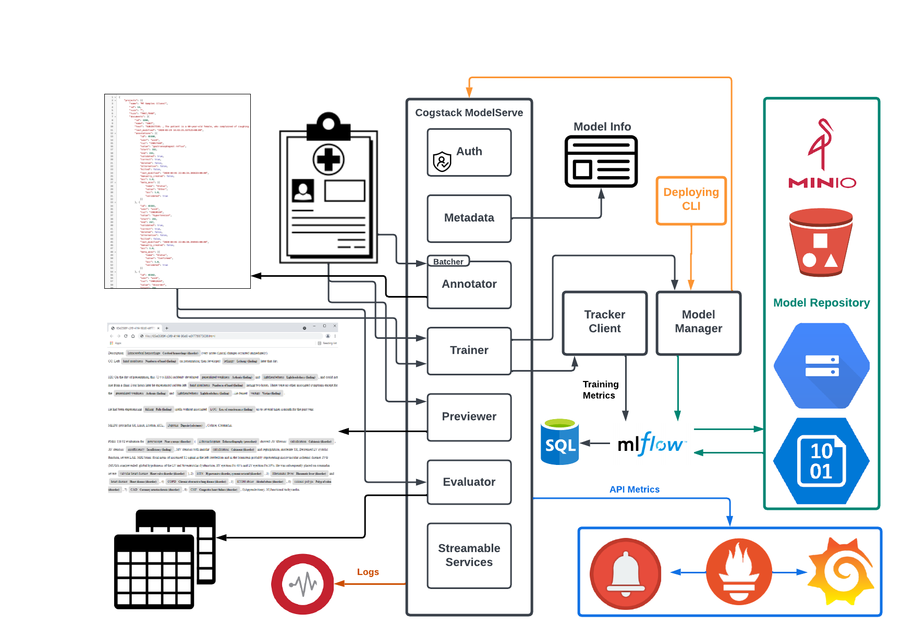

# What is this?

Cogstack ModelServe (CMS) is a model-serving and model-governance system created for a range of CogStack NLP tasks. Targeting language models with NER and entity linking capabilities, CMS provides a one-stop shop for serving and fine-tuning models, training lifecycle management, as well as monitoring and end-to-end observability.

## Install Dependencies
A virtual environment is highly recommended prior to installation. To install the dependencies, run the following command:
```commandline
pip install -e .
```

## APIs
Currently, CMS offers both HTTP endpoints for running NLP-related jobs and a command-line interface for administering model management tasks. Multi-language [SDKs](https://github.com/CogStack-ModelServe/cms-clients) are under development for providing increased accessibility.

[OpenAPI Docs](https://cogstack.github.io/CogStack-ModelServe/):
- [SNOMED MedCAT Model](https://cogstack.github.io/CogStack-ModelServe/docs/medcat_snomed_model_apis.html)
- [ICD-10 MedCAT Model](https://cogstack.github.io/CogStack-ModelServe/docs/medcat_icd10_model_apis.html)
- [UMLS MedCAT Model](https://cogstack.github.io/CogStack-ModelServe/docs/medcat_umls_model_apis.html)
- [De-ID MedCAT Model (AnonCAT)](https://cogstack.github.io/CogStack-ModelServe/docs/anoncat_model_apis.html)
- [De-ID Transformers Model](https://cogstack.github.io/CogStack-ModelServe/docs/transformers_deid_model_apis.html)
- [Hugging Face NER Model](https://cogstack.github.io/CogStack-ModelServe/docs/huggingface_ner_model_apis.html)
- [All-in-One Doc](https://cogstack.github.io/CogStack-ModelServe/docs/cogstack_model_serve_apis.html)

You can use the following commands to explore available CLI options (see in full [docs](./app/cli/README.md)):
```commandline
cms --help
cms serve --help
cms train --help
```

## Download models:

CMS runs the NLP model packaged in a ZIP file or a Gzipped tarball. To download pretrained GA models, please follow the [instructions](https://github.com/CogStack/MedCAT#available-models). Contact [Cogstack](contact@cogstack.org)
if you are interested in trying out Alpha release such as the de-identification model. To serve or train existing Hugging Face NER models, you can
package the model, either downloaded from the Hugging Face Hub or cached locally, as a ZIP or Gzipped tarball by running:
```commandline
cms package hf-model --hf-repo-id USERNAME_OR_ORG/REPO_NAME --output-model-package ./model    # will be saved to ./model.zip
```

## Run ModelServe in the system environment:

### Configuration:
Default configuration properties can be found in `./app/envs/.envs` and further tweaked if needed.

### Serve models via HTTP APIs
To serve NLP models from your system environment, run the following command:
```commandline
cms serve --model-type <model-type> --model-path PATH/TO/MODEL_PACKAGE.zip --host 127.0.0.1 --port 8000
```
Then the API docs similar to the ones shown above will be accessible at http://127.0.0.1:8000/docs.

### Servable Model Types:
The following table summarises the servable model types with their respective output concepts:

|    model-type     |  docker-service   |         output-spans          |
|:-----------------:|:-----------------:|:-----------------------------:|
|   medcat_snomed   |   medcat-snomed   | labelled with SNOMED concepts |
|   medcat_icd10    |   medcat-icd10    | labelled with ICD-10 concepts |
|    medcat_umls    |    medcat-umls    |  labelled with UMLS concepts  |
|    medcat_deid (anoncat)    |    medcat-deid    |  labelled with latest PII concepts   |
| transformers_deid | de-identification |  labelled with PII concepts   |
|  huggingface_ner  |  huggingface_ner  |    customer managed labels    |

## Run ModelServe in the container environment:

### Configuration:
Default configuration properties can be found and customised in `./docker/<MODEL-TYPE>/.envs`

### Serve models via HTTP APIs
To serve NLP models through a container, run the following commands:
```commandline
export MODEL_PACKAGE_FULL_PATH=<PATH/TO/MODEL_PACKAGE.zip>
export CMS_UID=$(id -u $USER)
export CMS_GID=$(id -g $USER)
docker compose -f docker-compose.yml up -d <model-service>
```
Then the API docs will be accessible at localhost on the mapped port specified in `docker-compose.yml`. The container runs
as a `cms` non-root user configured during the image build. Ensure the model package file is owned by the currently
logged-in user to avoid permission-related errors. If the file ownership is altered, you will need to rebuild the image.

Note that the CMS containers do not download remotely-hosted models during the launch process. Thus, after verifying
the authenticity of the model you are going to run, ensure the model package file will be correctly mounted
to the container as a volume with the destination path set to either `/app/model/model.zip` or `/app/model/model.tar.gz`.

### Auxiliary services
In addition to the core services such as serving, training and evaluation, CMS provides several ready-to-use components to help users make these production-ready. Their presence and default configuration can be customised to what suits your own needs. The diagram below illustrates the interactions between core and auxiliary services:
<p align="center">
  
</p>
:information_source: <small style="line-height: 1.2;">Some environment variables with opinionated naming conventions do not necessarily imply that the stacks are bound to a specific
cloud provider or even using a cloud service at all. For example, `AWS_ACCESS_KEY_ID` and `AWS_SECRET_ACCESS_KEY` are used
to set credentials for `minio`, the default storage service, rather than for Amazon Web Services.</small>

#### Model lifecycle management
CMS has embedded a `mlflow` stack to provide a pipeline of model lifecycle management, covering tracking of training/fine-tuning,
model registration, versioning on new models and so on.
```commandline
export MLFLOW_DB_USERNAME=<MLFLOW_DB_USERNAME>
export MLFLOW_DB_PASSWORD=<MLFLOW_DB_PASSWORD>
export AWS_ACCESS_KEY_ID=<AWS_ACCESS_KEY_ID>
export AWS_SECRET_ACCESS_KEY=<AWS_SECRET_ACCESS_KEY>
docker compose -f docker-compose-mlflow.yml up -d
```
The user authentication feature is optional and turned off by default. If you wish to enable it, consult the [Management](./app/management/README.md) documentation.

#### Work with the local/remote model registry:
All models are registered in a so-called model registry, which can be run either on a local machine or on a remote HTTP server. To work with the model registry, the prerequisites include setting up the following environment variables:
```commandline
export AWS_ACCESS_KEY_ID=<AWS_ACCESS_KEY_ID>
export AWS_SECRET_ACCESS_KEY=<AWS_SECRET_ACCESS_KEY>
export MLFLOW_TRACKING_URI=<MLFLOW_TRACKING_URI>
```

After that, you can run ModelServe with a registered model. For example, with `minio` as the model storage backend,
```commandline
cms serve --model-type medcat_icd10 --mlflow-model-uri s3://cms-model-bucket/EXPERIMENT_ID/RUN_ID/artifacts/REGISTERED_MODEL_NAME --host 0.0.0.0 --port 8000
```

You may want to push the package of a pretrained model to the registry before serving. For example, with `minio` being the model storage backend,
```commandline
cms register --model-type medcat_snomed --model-path PATH/TO/MODEL_PACKAGE.zip --model-name REGISTERED_MODEL_NAME
```

You can also serve a registered model through standard MLflow APIs instead of ModelServe APIs:
```commandline
mlflow models serve -m s3://cms-model-bucket/EXPERIMENT_ID/RUN_ID/artifacts/REGISTERED_MODEL_NAME -h 0.0.0.0 -p 8001
```
Then the `/invocations` endpoint will be up and running for model scoring. For example:
```commandline
curl http://127.0.0.1:8001/invocations \
    -H 'Content-Type: application/json' \
    -d '{"dataframe_split": { "columns": ["name", "text"], "data": [["DOC", "TEXT"], ["ANOTHER_DOC", "ANOTHER_TEXT"]]}}'
```

#### Monitoring and observability
By default, CMS exposes most services via HTTP APIs. Their monitoring can be performed by running the `mon` stack:
```commandline
export GRAFANA_ADMIN_USER=<GRAFANA_ADMIN_USER>
export GRAFANA_ADMIN_PASSWORD=<GRAFANA_ADMIN_PASSWORD>
docker compose -f docker-compose-mon.yml up -d
```

#### Log management
CMS provides a `log` stack to run services used for centralised logging and log analysis:
```commandline
export GRAYLOG_PASSWORD_SECRET=<GRAYLOG_PASSWORD_SECRET>
export GRAYLOG_ROOT_PASSWORD_SHA2=<GRAYLOG_ROOT_PASSWORD_SHA2>
docker compose -f docker-compose-log.yml up -d
```

#### Proxying
A reverse proxying service is available inside the `proxy` stack:
```commandline
docker compose -f docker-compose-proxy.yml up -d
```

#### API Authentication
An optional user database can be spun up if authentication is needed:
```commandline
export AUTH_DB_USERNAME=<AUTH_DB_USERNAME>
export AUTH_DB_PASSWORD=<AUTH_DB_PASSWORD>
docker compose -f docker-compose-auth.yml up -d
```
Before running ModelServe, define extra environment variables to enable the built-in
token-based authentication and hook it up with the database by following this [Instruction](./app/api/auth/README.md).

### Serve models via streaming HTTP APIs
You can send your texts to the CMS stream endpoint and receive NLP results as a stream. To that end,
start CMS as a streamable service by running:
```commandline
python app/cli/cli.py serve --streamable --model-type <model-type> --model-path PATH/TO/MODEL_PACKAGE.zip --host 127.0.0.1 --port 8000
```
Currently, [JSON Lines](https://jsonlines.org/) is supported for formatting request and response bodies. For example, the following request:
```commandline
curl -X 'POST' 'http://127.0.0.1:8000/stream/process' \
    -H 'Content-Type: application/x-ndjson' \
    --data-binary $'{"name": "DOC", "text": "TEXT"}\n{"name": "ANOTHER_DOC", "text": "ANOTHER_TEXT"}'
```
will result in a response like {"doc_name": "DOC", "start": INT, "end": INT, "label_name": "STR", "label_id": "STR", ...}\n...

#### Chat with served models
You can also "chat" with the running model using the `/stream/ws` endpoint. For example:
```html
<form action="" onsubmit="send_doc(event)">
    <input type="text" id="cms-input" autocomplete="off"/>
    <button>Send</button>
</form>
<ul id="cms-output"></ul>
<script>
    var ws = new WebSocket("ws://localhost:8000/stream/ws");
    ws.onmessage = function(event) {
        document.getElementById("cms-output").appendChild(
            Object.assign(document.createElement('li'), { textContent: event.data })
        );
    };
    function send_doc(event) {
        ws.send(document.getElementById("cms-input").value);
        event.preventDefault();
    };
</script>
```